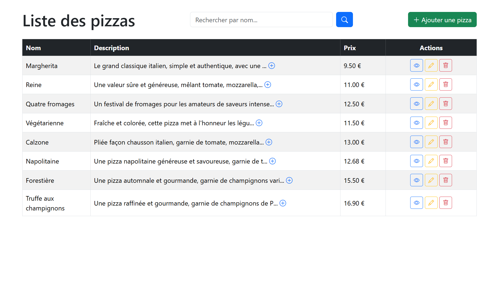

# Pizza CRUD

Système de gestion de pizzas en PHP (CRUD complet) avec PDO, MySQL/MariaDB et Bootstrap.

## Fonctionnalités

- Liste des pizzas avec recherche par nom
- Ajout, modification, suppression (avec confirmation en modale)
- Détail d'une pizza avec ses ingrédients
- Messages de confirmation colorés selon l'action (vert = ajout, bleu = modification, rouge = suppression)
- Suppression en cascade des ingrédients liés à une pizza

## Technologies

- PHP (PDO)
- MySQL / MariaDB
- Bootstrap 5

## Aperçu



## Structure du projet

```bash
php_cours/
├── index.php # Liste des pizzas (avec recherche)
├── item.php # Détail d'une pizza
├── php_cours.sql # Export de la base de données
├── CRUD/
│ ├── add.php # Ajouter une pizza
│ ├── edit.php # Modifier une pizza
│ └── delete.php # Supprimer une pizza
└── README.md
```

## Base de données

Base : `php_cours`

**Table `pizza`**
| Colonne     | Type          |
|-------------|---------------|
| id          | INT (PK)      |
| name        | VARCHAR(225)  |
| description | TEXT          |
| price       | DECIMAL(10,2) |
| origine     | TEXT (nullable) |

**Table `ingredient`**
| Colonne   | Type      |
|-----------|-----------|
| id        | INT (PK)  |
| name      | VARCHAR(100) |
| pizza_id  | INT (FK → pizza.id, nullable) |

## Installation de la base de données

Un export complet est disponible dans `php_cours.sql`. Pour l'importer :

1. Ouvre phpMyAdmin (`http://localhost:9988`)
2. Crée une base nommée `php_cours`
3. Sélectionne-la, va dans l'onglet **Importer**
4. Choisis le fichier `php_cours.sql`, clique sur **Exécuter**

## Lancer le projet (WSL Ubuntu)

**1. Démarrer la base de données (Docker)**

Depuis le dossier `mysql_docker` :

```bash
cd ~/dev/mysql_docker
docker compose up -d
```

Ça démarre MariaDB (port 3506) et phpMyAdmin (port 9988, accessible sur `http://localhost:9988`).

**2. Démarrer le serveur PHP**

Depuis le dossier du projet :

```bash
cd ~/dev/php/php_cours
php -S localhost:8000
```

**3. Ouvrir l'application**

Dans le navigateur : `http://localhost:8000/index.php`

## Connexion à la base de données

Utilisée dans chaque fichier PHP :

```php
new PDO('mysql:host=127.0.0.1;dbname=php_cours;port=3506', 'root', 'root');
```